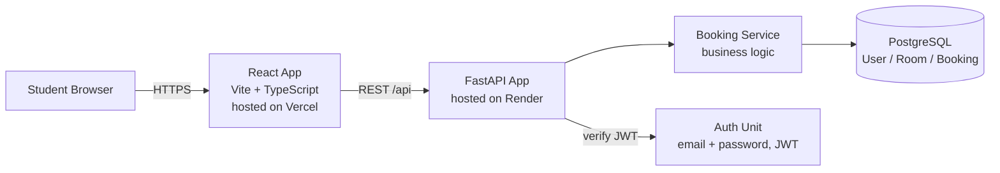

# Architecture — Component Diagram

## รายละเอียด

| Component | เทคโนโลยี | หน้าที่ |
|---|---|---|
| Student Browser | — | client ที่นักศึกษาใช้เข้าดู/จองห้อง |
| React App | Vite + TypeScript + Tailwind | แสดงหน้า landing, room list, ฟอร์มจอง (จะเพิ่มใน WS-02) |
| FastAPI App | Python 3.12 | รับ request จาก frontend, มี `/api/health` แล้ว, endpoint อื่นจะออกแบบใน WS-02 |
| Booking Service | ภายใน FastAPI App | business logic การจอง (สร้าง/ยกเลิก, เช็คห้องว่าง) |
| PostgreSQL | Docker (dev) | เก็บข้อมูล User, Room, Booking |
| Auth Unit | ภายใน FastAPI App | ยืนยันตัวตนด้วย email/password และออก JWT — รายละเอียดดู `memory-bank/units/auth/unit-brief.md` |

## หมายเหตุ

- Diagram นี้ขัดเกลาแล้วใน WS-02 Lab (ขั้นตอนที่ 2) จากฉบับร่างของ WS-02--before
- แต่ละ box ฝั่ง backend (Booking Service, Room Catalog — ไม่ได้วาดแยกในนี้เพื่อความกระชับ, Auth Unit)
  ตรงกับ unit brief หนึ่งไฟล์ใน `memory-bank/units/` — ดูรายละเอียดความรับผิดชอบและกฎธุรกิจที่นั่น
- Endpoint ทั้งหมดที่ API รองรับ ดู `docs/openapi.yaml`; ER ของข้อมูลที่เก็บใน PostgreSQL ดู
  `docs/erd.md`
