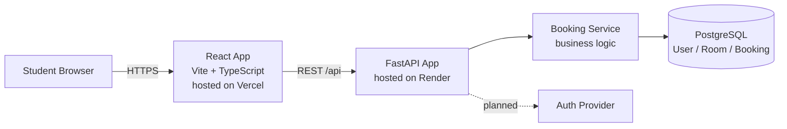

# Architecture — Component Diagram

## รายละเอียด

| Component | เทคโนโลยี | หน้าที่ |
|---|---|---|
| Student Browser | — | client ที่นักศึกษาใช้เข้าดู/จองห้อง |
| React App | Vite + TypeScript + Tailwind | แสดงหน้า landing, room list, ฟอร์มจอง (จะเพิ่มใน WS-02) |
| FastAPI App | Python 3.12 | รับ request จาก frontend, มี `/api/health` แล้ว, endpoint อื่นจะออกแบบใน WS-02 |
| Booking Service | ภายใน FastAPI App | business logic การจอง (สร้าง/ยกเลิก, เช็คห้องว่าง) |
| PostgreSQL | Docker (dev) | เก็บข้อมูล User, Room, Booking |
| Auth Provider | ยังไม่ตัดสินใจ | การยืนยันตัวตนนักศึกษา — **คำถามที่ยังตอบไม่ได้ ดู spec-questions.md** |

## หมายเหตุ

- Diagram นี้เป็นฉบับร่างจาก WS-02--before จะขัดเกลาเพิ่มใน WS-02 Lab (ขั้นตอนที่ 2)
- เส้นประ (`-.->`) หมายถึงส่วนที่ยังไม่ได้ implement จริง เป็นแผนที่วางไว้เท่านั้น
