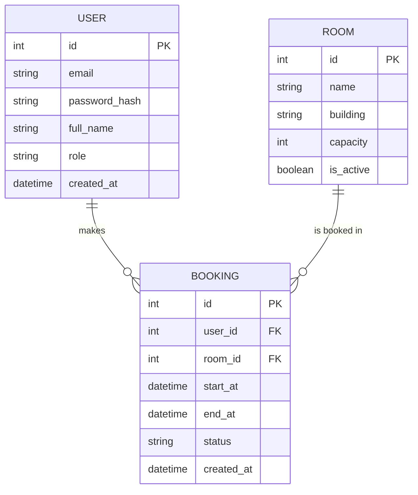

# ER Diagram — Room Booking

## หมายเหตุ

- `USER.role` — `student` เท่านั้นในเทอมนี้ (ดู Out of Scope ใน `memory-bank/intent.md`
  เรื่องบทบาทเจ้าหน้าที่/แอดมิน)
- `ROOM.is_active` — ใช้ soft-disable ห้องที่ปิดปรับปรุง โดยไม่ต้องลบข้อมูล booking เก่าที่อ้างถึงห้องนั้น
- `BOOKING.status` — ค่าที่เป็นไปได้: `confirmed`, `cancelled` เท่านั้นในเทอมนี้ (ไม่มี `pending` เพราะ
  ไม่มีขั้นตอนอนุมัติ — การจองสำเร็จทันทีถ้าห้องว่างและผ่านกฎ business rule)
- Business rule ที่ query ชั้น repository ต้องรองรับ (มาจาก `memory-bank/intent.md`):
  - เช็คไม่ให้ `BOOKING` สอง row ที่ `room_id` เดียวกัน, `status = confirmed`, และช่วงเวลา
    `[start_at, end_at)` ทับกัน
  - นับจำนวน `BOOKING` ของ `user_id` ที่ `status = confirmed` และ `end_at` ยังไม่ผ่านไป ต้อง ≤ 3
- Cardinality: USER 1 : N BOOKING, ROOM 1 : N BOOKING (BOOKING เป็น join entity ระหว่าง USER กับ ROOM
  ที่มี attribute ของตัวเอง คือช่วงเวลาและสถานะ)
